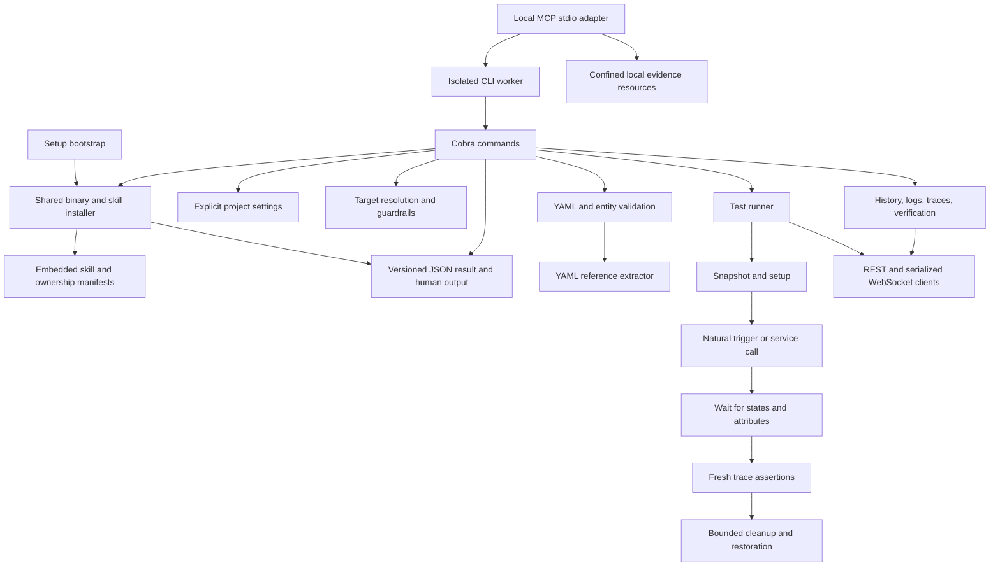

# Architecture

Denmother parses configuration locally and runs automation tests against Home
Assistant. Cobra commands compose Go packages and emit a shared JSON result
format. This guide maps features to the components you can extend.

`scripts/bootstrap.py` acquires the executable; `internal/install` manages binary
and skill installation. `skills/embed.go` embeds the skill, and
`scripts/release-assets.txt` defines archive contents. See
[installer internals](#installer-internals) for acquisition, ownership, and recovery.

`internal/operator` owns statuses, exit codes, target metadata, and result
serialization. `internal/haconfig` resolves credentials and rejects ambiguous
URLs. Production identity takes precedence over the hostname's locality.
`internal/project` resolves filesystem paths and opt-in home-repository policy.

`internal/hayaml` recognizes static entity references from YAML nodes with
source locations. It marks Jinja and `!input` references as dynamic without
evaluating them. `internal/validator` runs syntax, structure, policy, entity,
and HA-native schema checks. Native checks require the selected source to be
mounted, and the portable runtime's loaded hashes to match current files.

`internal/hatest` runs cases sequentially. Fresh trace IDs are compared with a
pre-trigger snapshot, and command contexts attribute runs to test actions;
timestamps establish action order. Cleanup has an independent context so
cancellation still permits restoration. Failed cleanup blocks later cases.

`internal/haaudit` correlates observed history with automation expectations.
Unknown/unavailable history stays in the timeline: recovery is not an ordinary
trigger, but later valid transitions are retained. Coverage and behavior failures
are reported separately. `internal/hasync` retains failed datasets and atomically
replaces successful snapshots, including empty ones.

The portable dev environment is embedded in the binary. Its HA network is
internal; only an nginx proxy has a loopback-published port. It bootstraps using
HA's authentication and onboarding APIs, waits for integration startup, and writes
local credentials outside tracked source. YAML and local web assets are refreshed
from the selected development source. Fixtures fill only absent display states;
scenarios replace selected display states and label them with their source.
The dashboard workflow discovers native YAML registrations and checks all selected
views in a browser, including saved development dashboards read through HA's
WebSocket APIs. Custom Compose templates are optional external inputs; the
embedded dashboard starter supplies synthetic scenarios and a local custom card.

`internal/mcpserver` preserves CLI operator results using subprocess argument
vectors because Cobra command state is process-wide. It owns typed tool arguments,
host-configured target policy, worker cancellation, OS runtime locks, bounded
output, and opaque evidence resources. See [MCP contracts](mcp.md).

## Extend a feature

| Feature | Main implementation | Useful verification |
| --- | --- | --- |
| Static checks and source locations | `internal/hayaml`, `internal/validator` | YAML fixtures, dynamic-reference cases, native source identity checks |
| Tests and trace assertions | `internal/hatest` | Waits for states and attributes, fresh trace attribution, failure and cleanup regressions |
| Dashboard previews | `cmd/dev_dashboard*.go` | YAML/storage discovery, real browser cards, per-view screenshots and errors |
| Fixtures and scenarios | `cmd/dev_fixtures_runtime.go`, `cmd/dev_scenario.go` | Preserve integration states during seeding; label synthetic states with their source |
| Read-only diagnostics | `internal/haaudit`, `internal/hasync`, `internal/haverify`, `internal/discover` | Missing coverage, unavailable entities, registry identities, partial results |
| Agent assistance | `cmd/agent*.go`, `cmd/test_plan.go`, `cmd/docs.go` | Selected-project paths, diff coverage, executable next actions, evidence retention |
| Installation | `internal/install`, `scripts/bootstrap.py` | Ownership, interrupted upgrades, independent installed payloads |
| MCP transport | `internal/mcpserver` | Real workers, typed inputs, cancellation, confined evidence, CLI result parity |

HTTP, WebSocket, and subprocess operations should use the
context-aware APIs so cancellation reaches active work. Test cleanup has a
separate deadline, preserving the opportunity to restore state after a canceled
run. See [Contributing](../CONTRIBUTING.md) for checks to run and
[automation testing](testing.md) for runtime recipes and cleanup support.

## Installer internals

Use [Installing Denmother](installing.md) for commands and troubleshooting.
The contracts below describe implementation requirements; the
[release guide](releasing.md#installer-acceptance) covers acceptance tests.

### Installer source map

| Responsibility | Source |
| --- | --- |
| Shell entry point and executable acquisition | `setup`, `scripts/bootstrap.py` |
| CLI flags and result mapping | `cmd/skills.go` |
| Harness detection and destination planning | `internal/install/harness.go` |
| Ownership, content inspection, and application | `internal/install/install.go` |
| Metadata validation and limits | `internal/install/metadata.go` |
| Journal validation, rollback, and recovery | `internal/install/transaction.go` |
| Canonical embedded skill and archive allowlist | `skills/embed.go`, `scripts/release-assets.txt` |

When changing payloads, update the canonical resources and exercise both direct
skill registration and bootstrap installation.

### Executable acquisition

`setup` is a Bash entry point for `scripts/bootstrap.py`. The bootstrap selects
Linux/macOS amd64 or arm64, acquires and verifies an executable, then invokes
`dm setup`. The Go installer also backs `dm skills install/status/uninstall`.
Harness paths and ownership policy belong in Go. Installation does not resolve
HA credentials, start HA or an agent, modify automation YAML, or configure MCP.
See [installation inputs](installing.md#inputs-and-plans) for supported sources,
checksums, offline mode, and dry-run behavior.

The bootstrap checks every archive entry against `scripts/release-assets.txt`,
shared with the Go packager. It rejects traversal, absolute paths, unsafe links,
nonregular entries, duplicate names, unexpected payloads, and excessive sizes.
Only the binary needs extraction because it embeds the complete skill.

Extraction reads an immutable in-memory snapshot of the verified bytes.
Compressed input and gzip expansion are each capped at 512 MiB before tar
metadata parsing, including extended headers; sparse entries are rejected.
Malformed version/release JSON and duplicate keys fail with structured errors.
A delegated process crash or invalid result returns an incomplete operator result
instead of unparseable stdout or an invalid exit code.

Executable headers must match the selected host before the version command runs.
The reported version and platform must match the requested release before
installation. Source builds and supplied binaries retain local provenance.
Release-origin checksums verify integrity against the published checksum; they
do not independently authenticate the publisher.

Acquisition precedes destination planning when no compatible binary is available.
Without one, bootstrap dry-run returns a partial acquisition plan with deferred
destination and payload checks. Dry-run and status create no directories or
lock files. Installer commands reject `--compact` and `--evidence-dir`, including
on error paths, to preserve that behavior.

### Destination planning and registration

The Go core resolves and deduplicates destinations, inspects ownership and local
edits, plans all operations, applies permitted changes, and verifies registrations.
`dm setup` also executes the installed binary's version command. It reports PATH
resolution and shadowing without editing shell startup files.

Homebrew Cellar and Nix store binaries are preserved as package-owned files.
Conflicting package-owned PATH executables produce upgrade/registration guidance.
Other foreign binaries are not adopted merely because they are named `dm`.

Harness adapters define detection, user/project locations, configuration-home
overrides, and session guidance. Keep paths and discovery evidence in the adapter;
see the [registration table](installing.md#harness-registration) for the current
rules. Reports retain detected evidence and selected harnesses. Unselected
harnesses get no directories; no detected harness still permits binary installation
with an advisory and explicit registration command.

Managed skills include all resources and survive deletion of input archives,
staging directories, and checkouts. Instructions resolve `dm` through PATH and
contain no installing user's absolute binary path. Ownership manifests record the
resolved destination, so moving a checkout requires rechecking registration.
Setup does not edit `AGENTS.md` or `CLAUDE.md`; optional project instructions and
the unmanaged `--skill` copy belong to `dm init`.

### Ownership and recovery

Skill ownership is recorded in `DESTINATION/.denmother-install.json`, outside
`SKILL.md`. Binary ownership is recorded in `BIN_DIR/.dm.denmother.json`.
Manifests include format version, installation ID, origin, owner, revision,
Denmother/skill versions, content digest, CLI/result compatibility metadata,
harness, scope, resolved destination, installed-file hashes, and previous
version/digest.

Ownership and modification are checked separately. Identical payloads are
skipped. Upgrades replace unchanged owned files and preserve unrelated content.
Foreign directories, unrelated binaries, symlink destinations, and edited owned
files block replacement with paths and recovery guidance. Existing `init --skill`
copies have no installer manifest and are treated as unmanaged. There is no
force-adoption or automatic overwrite mode. Metadata parsing rejects duplicate
and unknown fields, invalid aggregate/file digests, overlapping paths, reserved
installer names, and platform-specific path aliases. Manifests are limited to
1 MiB and 4,096 files; managed files to 128 MiB; raw transaction snapshots to
256 MiB; encoded journals to 384 MiB. Metadata records do not authenticate an
owner against another writer with access to the same account.

Mutation takes OS file locks at `DESTINATION.denmother-lock`, acquired in sorted
order. Lock files persist, but the OS releases locks when a process exits.
Concurrent installers fail instead of interleaving writes. Files are staged,
flushed, and individually renamed; a multi-harness installation is not one
filesystem transaction.

Before replacement, a `MANIFEST.transaction` journal records previous and intended
contents. Interrupted operations report completed and remaining files. A retry
with `--recover` checks files against both states, rolls back the recorded
transaction, and replans. Subsequent user edits block recovery and are preserved.
Journals must end with valid previous/intended ownership metadata, and every
payload change must match those file hashes. Binary recovery is confined to the
binary and its sidecar. Rollback restores payload first, then its manifest,
preserves original permissions where supported, and distinguishes absent from
empty files. Empty directories from an interrupted first installation are
removed before replanning. Recovery progress remains visible in
`operations[].recovery` even when a later plan is blocked, separating restored,
already-restored (skipped), and remaining paths. Caller cancellation
stops subsequent changes and leaves started transactions recoverable. Error
classification uses typed failures rather than matching words in file paths.

See [recovery instructions](installing.md#ownership-and-recovery) for resolving
edits and choosing another destination.

Uninstall removes only unchanged owned skill files and empty directories. It
preserves edited files, replacement symlinks, and unrelated contents, reporting
leftovers and retaining ownership records needed for a later retry. Reinstalling
after partial uninstall restores required resources once conflicts are resolved.
Uninstall does not remove binaries, project settings, credentials, or HA runtime
state.

### Installer result contract

CLI operations use `dm.operator.v1`. Bootstrap errors and partial acquisition
plans use its envelope and exit conventions; progress stays on stderr in JSON
mode. The Go installation step contains `details.installation`, including:

- Plan ID, resolved version, origin/revision, scope, and project.
- Detection evidence, selected harnesses, destinations, and session guidance.
- Operations with planned/applied/skipped states, ownership manifests, missing
  and modified files, conflicts, preserved leftovers, and applied/remaining files.
- Registration verification, exact embedded-content compatibility, selected
  binary, PATH resolution, and package ownership.

Status is read-only and checks the selected registrations. Filesystem verification
does not prove that an active session loaded a skill; `harness_invoked` remains
false.

Reports retain earlier applied operations when a later step fails. Inspect the
top-level status and individual operations before retrying. See
[installer results](installing.md#results-and-troubleshooting) for exit codes,
error codes, and recovery commands.
